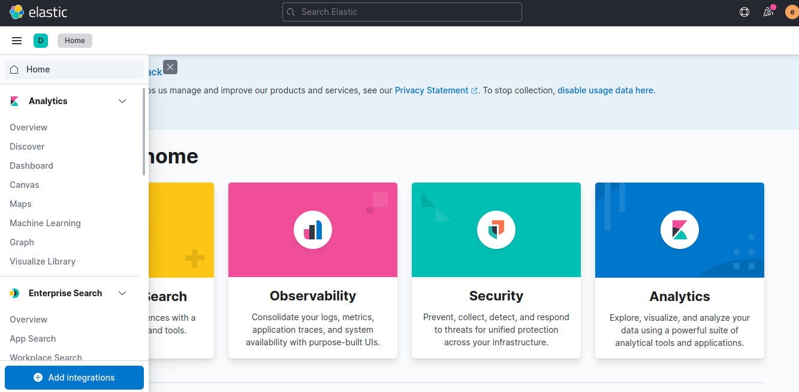

# Applying log aggregation pattern in microservices

When it comes to microservices, we know that it is extremely important to apply the log aggregation pattern, right? 
For those who don't know or haven't heard about this pattern, it has the motivation to solve the problem of having multiple logs spread throughout our microservices ecosystem, where it centralizes all the logs in a single place, this helps us to monitor our apps.

Alright, let's get started...
In order to continue, it is mandatory to have docker and docker-compose installed on the machine, if you don't have them, please install them.

Now, to give a better general understanding of this project, it is basically divided into its microservices with log aggregation, as shown in the image below:
 

We can see in this image that there are 3 microservices available which are: **demoA-api, demoB-api and demoC-api.**

<ul>
    <li>demoA-api -> It is basically a gateway that is available to be accessed externally and forwards the request to the demoB-api microservice which then retrieves its proper response.</li>
    <li>demoB-api -> It is inaccessible externally and is only visible on the internal network, which passes the request to another microservice demoC-api, which then retrieves its proper response and sends it to the demoA-api.</li>
    <li>demoC-api -> This is inaccessible externally and only accessible on the internal network and sends the response to the microservice demoB-api</li>
    <li>elasticstack* -> This was the solution adopted so that we could implement the log aggregation pattern, which is responsible for monitoring microservices logs</li>
</ul>

Now let's understand how the elasticstack was divided and also built from taking the log, processing it and making it available in a visual way, as shown in the image below:

We can see in this image that there are 4 dockers available which are: **Filebeat, Logstash, Elasticsearch and Kibana.**

<ul>
    <li>Filebeat -> Monitors logs from containers that are on the same network and sends them to logstash</li>
    <li>Logstash -> Receives the filebeat logs and processes them, in this case we are only processing the information contained in our microservices. After processing, it sends them to elasticsearch.</li>
    <li>Elasticsearch -> Receive logs, store and index them. We can visualize the logs visually here, where it is also possible to create queries on top of these logs.</li>
    <li>Kibana -> It is another way of viewing the logs stored in elasticsearch, we can use it as a panel for example and in it we create queries to return information that we consider interesting to view.</li>
</ul>

**Important considerations:**
<ul>
    <li>The idea of this project was more focused on demonstrating the application of the log aggregation pattern and this implies in its infrastructure, the microservices themselves are not relevant, they are quite trivial.</li>
    <li>The project was created to run on any operating system as long as it has docker and docker-compose installed.</li>
    <li>There are other types of configurations and ways to do it, but the intention here is to be as simple as possible to have a better absorption of the knowledge of this pattern both in theory and in practice.</li>
</ul>

Well... It's time, let's roll this whole joke? ;)

1) First we must start all our microservices, as well as our log aggregation. Let's type the command in the terminal: `docker-compose up -d`
2) Let's wait a few seconds for the solution to upload completely, as soon as the environment is available access the following URL:
[http://localhost:5601/login?next=%2F]()
3) We will see this screen:
 

Note: The username and password will be filled in automatically, however the access credentials are elastic(user) and changeme(password)

4) Right after logging in, go to the menu on the side, go to "Analytics" and select the "Discover" option, follow the image for help:

5) After clicking on "Discover" a modal will appear, which is for creating an index. Click on the "Create index pattern" button and once you do, the following screen will appear, as shown in the image below:

<ul>
    <li>In the first information to be filled in, we must adopt the contains pattern; i.e; I can inform `filebeat-*` that it brings me all the logs, if we wanted something specific to recover the logs referring to the month of that particular year we could adopt `filebeat-7.16.3-2023.03.*` </li>
    <li>In the second information to be filled in, we must select `@timestamp`, as shown in the image.</li>
</ul>

6) Let's run curl: `curl --location --request GET 'http://localhost:8080'` to appear in the logs.

7) After creating this index, we must return to the "Discover" menu again, which will result in the logs, as shown in the following image:

